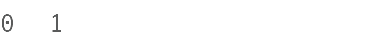

# Algorithm Drill: The Fibonacci Sequence

Fibonacci Sequence, with tests!

# The Fibonacci Sequence

The sequence is built by following simple rules:

- The sequence starts with 0 and 1.
- The next number in the sequence is the sum of the last two numbers in the sequence.

*Figure 1*. Building the Fibonacci sequence.

Following these rules we can build the Fibonacci sequence:  0, 1, 1, 2, 3, 5, 8, 13 ... (see Figure 1).

